<h1 align="center"> Feast Your Eyes</h1>

[View the live project here](https://p5-feast-your-eyes-d27a109d8aa0.herokuapp.com/)

Feast Your Eyes is a dynamic social media platform dedicated to the vibrant world of culinary experiences.

On this platform, users can indulge their passion for food by sharing captivating images of delectable dishes, writing insightful reviews for restaurants, and engaging in a visual symphony of culinary delights.

To unlock additional features such as liking/unliking posts and submitting reviews, users can easily register and sign in, enhancing their overall experience and interaction with the Feast Your Eyes community.

[For the API please visit](https://github.com/yamesjamess/p5-feast-your-eyes-drf-api)

## Table of Contents

- [User Experience](#user-experience)
- [Features](#features)
- [Design](#design)
- [Technologies Used](#technologies-used)
- [Testing](#testing)
- [Deployment](#deployment)
- [Credits](#credits)

## User Experience

### User Stories :

- **USER STORY (#1)** : Project Requirement

  - As a developer I can list up all the requirements so that set up my project and start the development accordingly.

- **USER STORY (#2)** : Project Setup

  - As a developer I can use all the info from the requirement to set up a repo so that I can start develop to API model and the front end.

- **USER STORY (#3)** : Profiles Model

  - As a admin I can login to the admin panel so that I can manage user profiles.

- **USER STORY (#4)** : Posts Model

  - As a superuser I can manage Posts so that I can create, update, delete and view the details of the posts I wish to display.

- **USER STORY (#5)** : Likes Model

  - As a superuser I can manage the Likes so that I can create, update, delete and view the likes of the posts I wish to display.

- **USER STORY (#6)** : Comments Model

  - As a superuser I can manage Comments so that I can create, update, delete and view the details of the comments I wish to display

- **USER STORY (#7)** : Recommended Model

  - As a superuser I can manage the Recommendations so that I can create, update, delete and view the recommendations of the posts I wish to display.

- **USER STORY (#8)** : Followers Model

  - As a superuser I can manage the Followers so that I can create, update, delete and view the followers I wish to display.

- **USER STORY (#9)** : Create Landing Page & Navigation
  - As a website user I can visit the website and see the landing page and navigation so that I can navigate the website to use it's functionality.
- **USER STORY (#10)** : Routing NavBar
  - As a website user I can navigate each page seamlessly so that I do not need to wait for page refresh.
- **USER STORY (#11)** : User Registration
  - As a website user I can register for an account so that I can access all the functions of the site.
- **USER STORY (#12)** : User Login
  - As a website user I can login to my account so that I can use the website's full function.
- **USER STORY (#13)** : User Logout
  - As a website user I can logout of my account so that protect my account from other user from using my account.
- **USER STORY (#14)** : Refresh Access Toekns
  - As a website user I can maintain my logged-in status until I logout or for 24 hours after the last activity so that I can use the website without interruption.
- **USER STORY (#15)** : Profile Page - View
  - As a logged in User I can view my profile so that I can see the details I have entered about myself.
- **USER STORY (#16)** : Profile Page - Edit
  - As a logged in User I can edit my profile so that I can change my personal info.
- **USER STORY (#17)** : Update Password
  - As a logged in User I can update my password so that I can change my password if I need to.
- **USER STORY (#18)** : Update Username
  - As a logged in User I can change my username so that I can change my username if I want to.
- **USER STORY (#19)** : View Posts
  - As a User I can click on the Homes button in the NavBar so that I can see all the posts in the system.
- **USER STORY (#20)** : Search Posts
  - As a User I can enter a query in the search bar so that I can find a post easily.
- **USER STORY (#21)** : Filtered Posts
  - As a logged in User I can filter the post cards so that I can display them in the order I want.
- **USER STORY (#22)** : Add Post
  - As a logged in User I can click on the Add Post button in the NavBar so that I can add the post details to a form and save to the database.
- **USER STORY (#23)** : Edit Post
  - As a logged in User I can click on the Edit Post button in the corner of the post card so that I can edit the post details to a form and save to the database.
- **USER STORY (#24)** : Delete Post
  - As a logged in User I can click on the Delete Post button in the corner of the post card so that I can delete the post from the database.
- **USER STORY (#25)** : Add Comment
  - As a logged in User I can add a comment so that I can leave any comments about a particular post.
- **USER STORY (#26)** : Edit Comment
  - As a logged in User, and creator of a comment, I can click on the pencil item of a comment I have written so that I can update it if I want to.
- **USER STORY (#27)** : Delete Comment
  - As a logged in User, and creator of a comment, I can click on the bin icon of a comment I have written so that I can delete it if I want to.
- **USER STORY (#28)** : View Comment
  - As a User I can click on the post card so that I can see all the comments in the particular post.
- **USER STORY (#29)** : Add Like
  - As a logged in User I can click the like button so that I can leave a like on a particular post.
- **USER STORY (#30)** : Delete Like
  - As a logged in User I can click the like button so that I can delete a like on a particular post that I already liked previously.
- **USER STORY (#31)** : Add Recommend
  - As a logged in User I can click the star button so that I can leave a recommendation on a particular post.
- **USER STORY (#32)** : Delete Recommend
  - As a logged in User I can click the star button so that I can delete a recommendation on a particular post that I already recommended previously.
- **USER STORY (#33)** : Following and Unfollowing a Profile
  - As a logged in user I can follow and unfollow other user so that I can see and remove posts by specific users from my feed.
- **USER STORY (#34)** : Top Recommendations
  - As a user I can see which post has the highest amount of recommendations so that I can see which post is most popular and check it out.
- **USER STORY (#35)** : Tags
  - As a user I can tag my posts and see other post's tag so that make a quick judgement of the post.
  - As a user I can filter by tag so that see all the relevant posts.
- **USER STORY (#36)** : Testing
  - As a developer I can test my code with unit test or manual testing so that check if my codes are working.
- **USER STORY (#37)** : Deployment
  - As a developer I can deploy the project to Heroku so that the user can access the website.
- **USER STORY (#38)** : Documentation
  - As a developer I can write a comprehensive documentation so that other developer can read the README.md and understand my project.

## Features

### Existing Back End Features

**BE Feature (#1)** : Django Rest Framwork

- Since the front end website is being built using React, there is no need for the backend server to return HTML documents.
- Django Rest Framework is a powerful tool to create, read, update, delete data in JSON form.

**BE Feature (#2)** : Profile Model

- The profile model includes these fileds
  - owner: a 1to1 field linking with User model that is created upon successful profile creation. Cascade on deletion.
  - created_at: DateTimeField with auto_now_add=True
  - updated_at: DateTimeField with auto_now=True
  - name: CharField with max length of 255 (optional)
  - content: TextField (optional)
  - image: ImageField (optional, placeholder is add on creation)

**BE Feature (#3)** : Post Model

- The post model includes these fileds
  - owner: ForeignKey field linking with User model. Cascade on deletion.
  - created_at: DateTimeField with auto_now_add=True
  - updated_at: DateTimeField with auto_now=True
  - restaurant: CharField with max length of 255
  - title: CharField with max length of 255
  - name: CharField with max length of 30 (optional)
  - content: TextField (optional)
  - image: ImageField (optional, placeholder is add on creation)
  - image_filter: CharField with choices.

**BE Feature (#4)** : Like Model

- The like model includes these fileds
  - owner: ForeignKey field linking with User model. Cascade on deletion.
  - post: ForeignKey field linking with Post model. Cascade on deletion.
  - created_at: DateTimeField with auto_now_add=True

**BE Feature (#5)** : Comment Model

- The comment model includes these fileds
  - owner: ForeignKey field linking with User model. Cascade on deletion.
  - post: ForeignKey field linking with Post model. Cascade on deletion.
  - created_at: DateTimeField with auto_now_add=True
  - updated_at: DateTimeField with auto_now=True
  - content: TextField

**BE Feature (#6)** : Recommended Model

- The recommend model includes these fileds
  - owner: ForeignKey field linking with User model. Cascade on deletion.
  - post: ForeignKey field linking with Post model. Cascade on deletion.
  - created_at: DateTimeField with auto_now_add=True

**BE Feature (#7)** : Follower Model

- The follower model includes these fileds
  - owner: ForeignKey field linking with User model. Cascade on deletion.
  - followed: ForeignKey field linking with User model. Cascade on deletion.
  - created_at: DateTimeField with auto_now_add=True

### Existing Front End Features

**FE Feature (#1)** : React

- The website is created using React to render the user interface (UI).
- The data is accessed through a Django Rest Framework API.
- Using React gives the user a seamless expreience when using the website since there are no loading screens between each page visit.
- All the components are independently refreshed based on their dependencies in the useEffect hook.

**FE Feature (#2)** : Navigation bar

- The navigation bar's design and placement is consistent on every page.
- The navigation bar features the brand's Logo and Home links
- If the user is **not signed in**, the user can see links that take them to the Register and sign in page.
- If the user is **signed in**, the user can see the add post, home, feed, liked, recommended, logout, user avatar, and username.
- The navigation bar is fully responsive on multiple screen sizes. On smaller screens, the links collapse into a "Hamburger" style menu

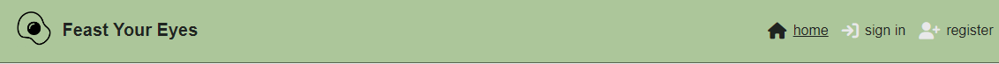

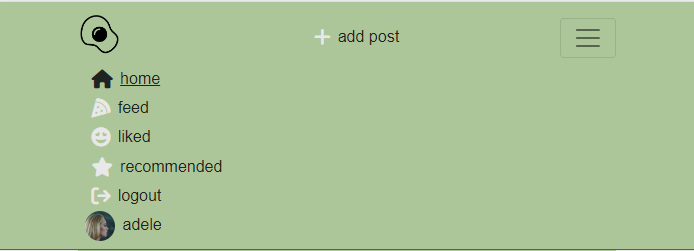

**FE Feature (#3)** : Home Page

- The home page is also known as the posts list page, is a page where all the posts that has been created are displayed to the user.
- The home page features the search bar, top 5 recommended posts, most followed profile list, filter by tags lists, and lists of posts.

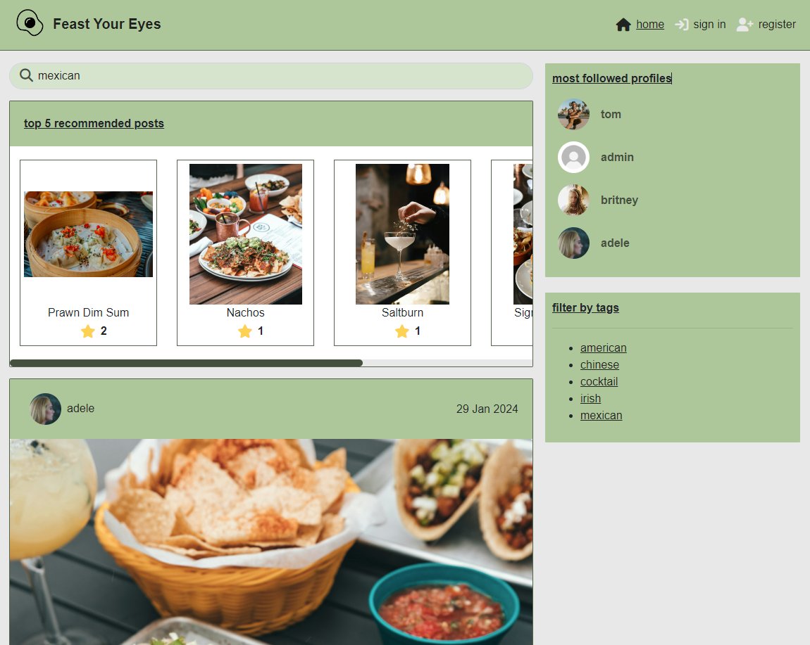

**FE Feature (#4)** : User Registration

- To fully utilise the website's function the user need to be signed in.
- The user can create an account by visiting the Registration page.
- Error messages are display if the form is invalid.
- The user will be redirected to the sign in page when submitted a valid form.

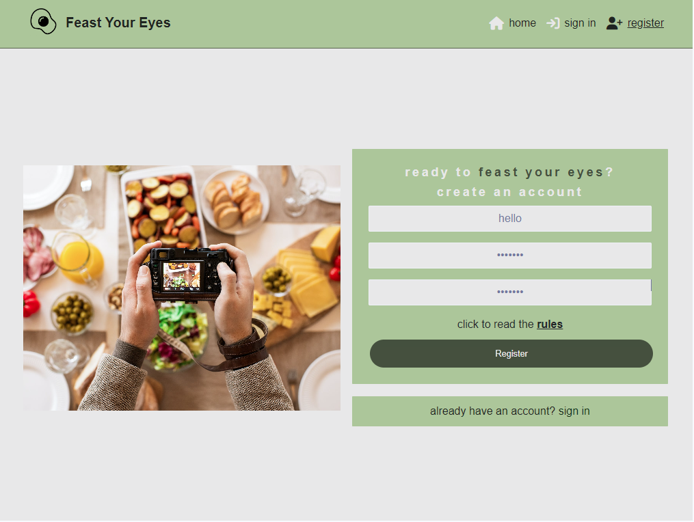

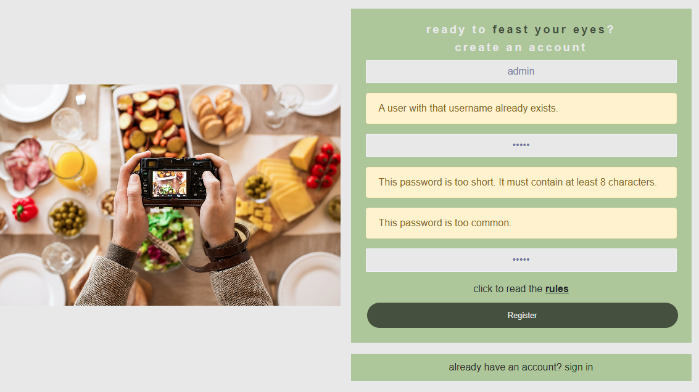

**FE Feature (#5)** : Rules/Guidelines Modal

- To ensure that the user are aware of the Rules/Guidelines for using the website before they create an account, the rules link is place right before the user submits the form.
- The Rules/Guidelines modal are also placed within PostCreateForm and PostEditForm to remind the user.

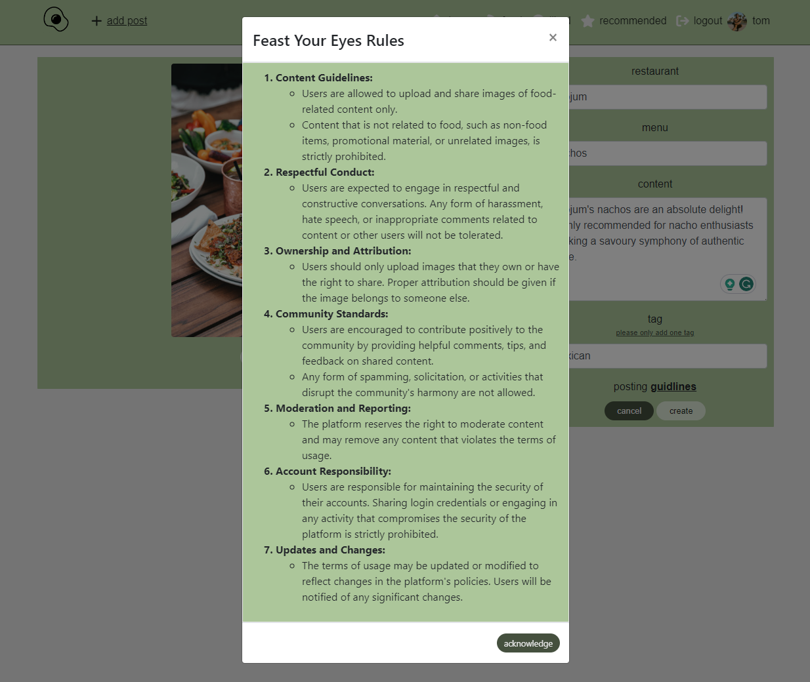

**FE Feature (#6)** : User Sign in

- To fully utilise the website's function the user need to be signed in.
- The user can enter their credentials and sign in to the system.
- Error messages are display if the form is invalid.
- The user will be redirected to the Home page after successfully signing in.

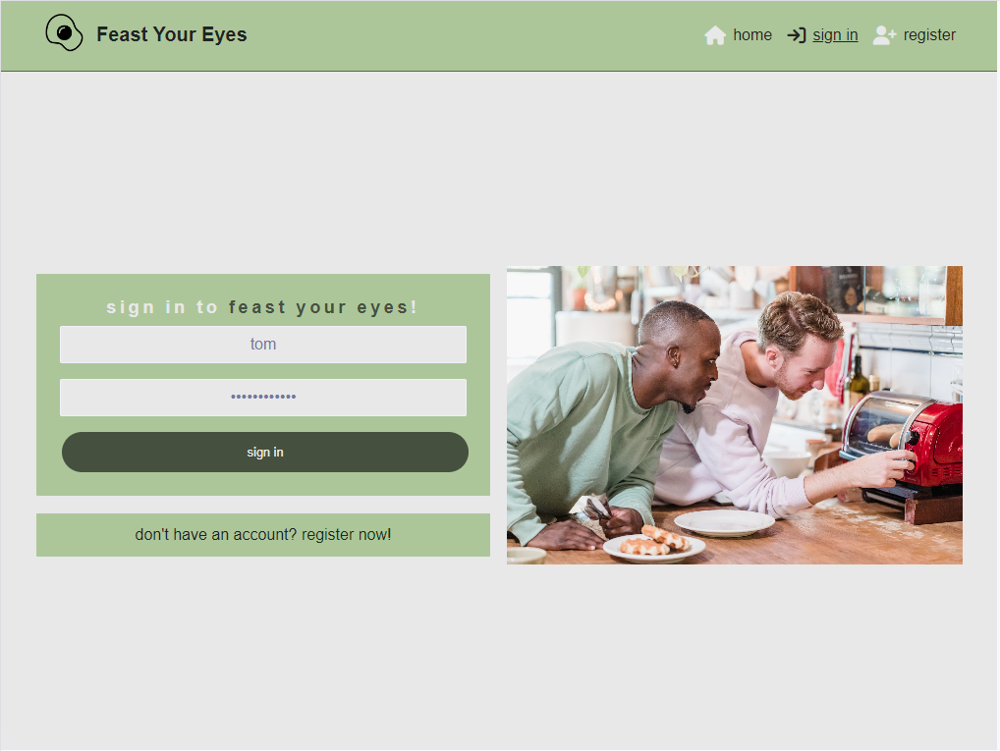

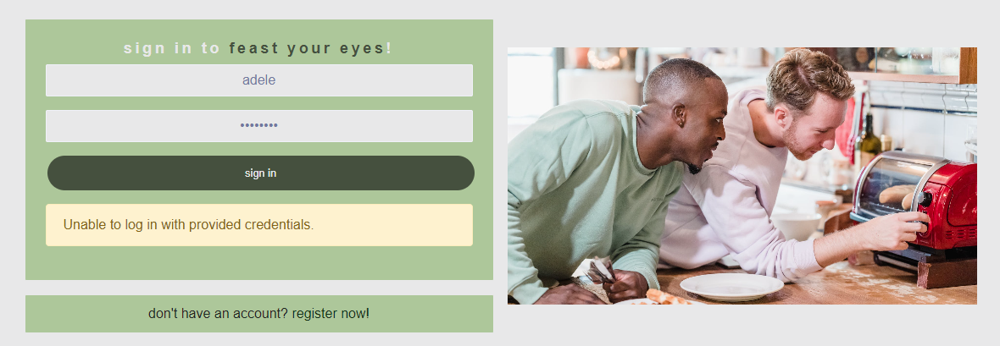

**FE Feature (#7)** : Add Post

- Only signed in user can use this feature.
- The user can click the button the appear instead of the Feast Your Eye text icon to create a post.
- They can then add an image and fill out the form fields.
- They can then create the post by clicking create.
- If the form is invalid, errors will be shown.
- If the image is not added, placeholder image will be uploaded in its place.

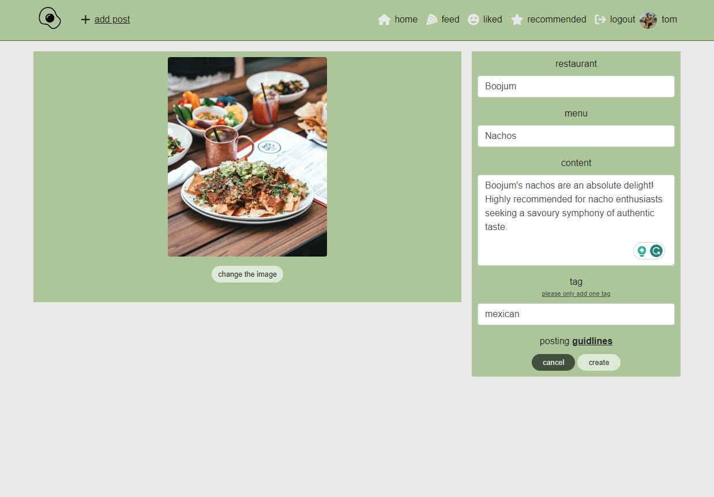
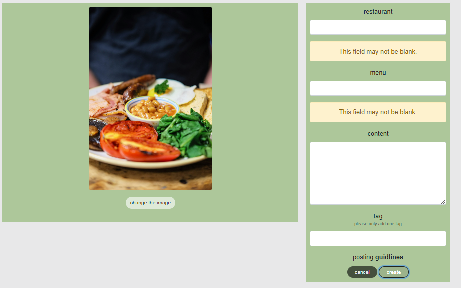

**FE Feature (#8)** : Search bar

- The search bar is featured on the top of the home page. It is also available on the Feed, Liked, and Recommended page.
- The user doesn't require to sign in to use the search bar, however the search function on Feed, Liked, and Recommended page won't be available since those pages are only available after signing in.
- The search bar accepts any written query, and will search through the all the posts fields (restaurant, menu, content, and tags).
- The results will then be displayed after a brief moment. A spinner is display to show the user that the result is loading.
- If no reulsts found, it will display the no result icon accordingly.

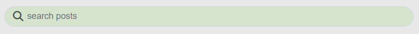

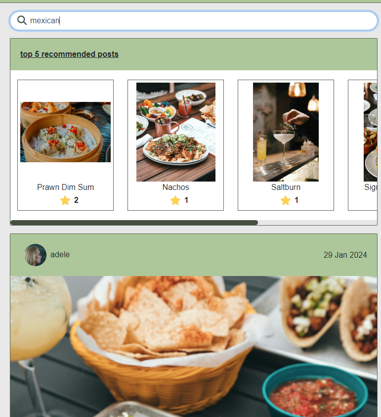

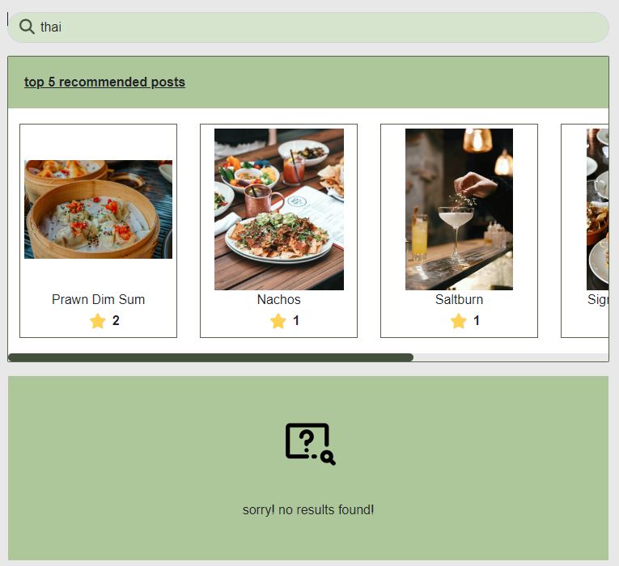

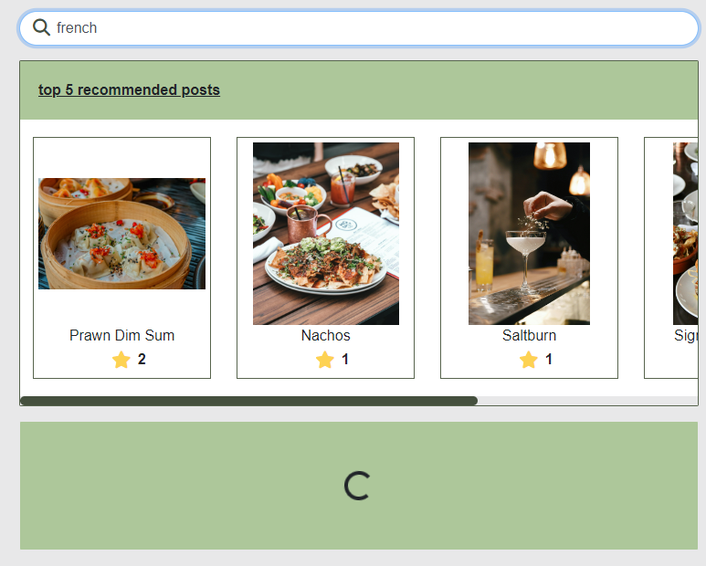

**FE Feature (#9)** : Top 5 Recommended

- The Top 5 Recommended display 5 posts with the most recommendation counts.
- It only displays the image, menu, recommendation counts and star icon to limit overloading user with information and cluttering.
- The user can click on the image to visit the Post's detail page.

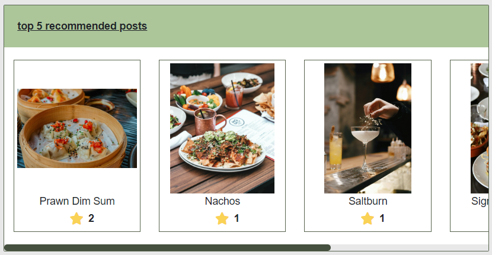

**FE Feature (#10)** : Popular Profile

- On the right handside of the screen, the users can see which profile has the most followers
- Only signed in user can see the follow/unfollow button.
- The signed in user can use the button to follow/unfollow a profile.
- The button is not available on mobile deviced, the user must go to their profile page to follow/unfollow a profile.
- There's a limit of 20 profiles displayed on desktop and 4 on mobile.

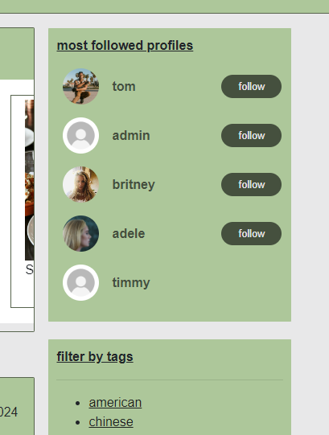

**FE Feature (#11)** : Posts List

- Underneath the Top 5 Recommended container, the user can find the Posts list.
- The Posts list displays all the post and their details (restaurant, menu, content, tag, like button, like count, recommend button, recommend count, comment button, comment count) from all users.
- The Posts list featured Infinity scroll when there are more than 10 posts.

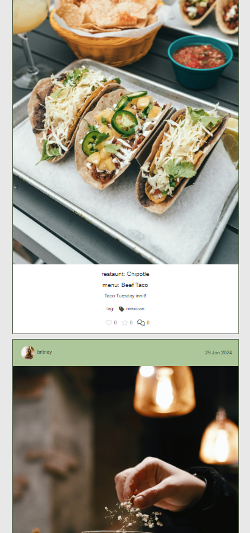

**FE Feature (#12)** : Filter by tags

- Underneath the Popular Profiles, the user can find the filter by tags links
- When the use clicks the tag link, it will display the user all the posts with that tag.
- This feature is not availble for mobile users, however they can achieve a similar result by using the search bar.

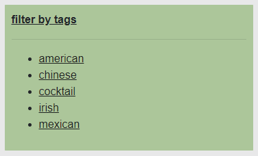

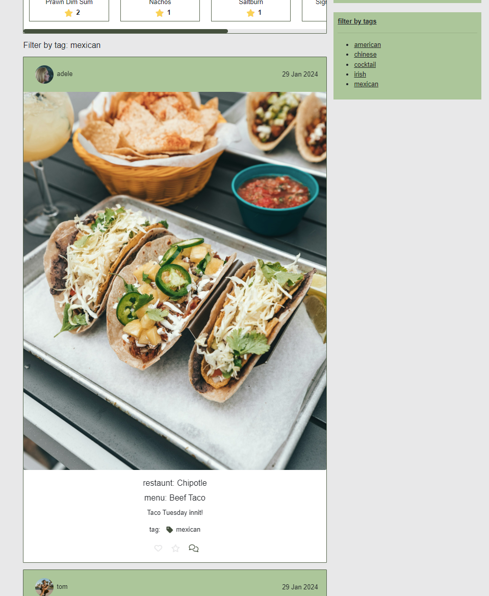

**FE Feature (#13)** : Like / Unlike

- Only signed in user can use this feature. The icon will be muted for them and an overlay will show them a message.
- Post's owner cannot like their own posts. The icon will be muted for owner and an overlay will show them a message.
- Other users can like by clicking the heart outline, it will turn solid and the count will increase by 1.
- To unlike, simply click the solid heart and it will turn to an outline

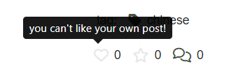

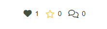

**FE Feature (#14)** : Recommend / Un-recommend

- Only signed in user can use this feature. The icon will be muted for them and an overlay will show them a message.
- Post's owner cannot recommend their own posts. The icon will be muted for owner and an overlay will show them a message.
- Other users can recommend by clicking the star outline, it will turn solid and the count will increase by 1.
- To un-recommend, simply click the solid star and it will turn to an outline

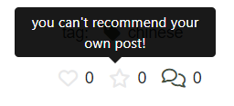

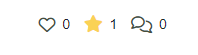

**FE Feature (#15)** : Posts Detail page

- Post Detail page displays only one post depending on which posts the user clicked on.
- The Post Detail page only consists of the post component, comment component and the popular profile component.

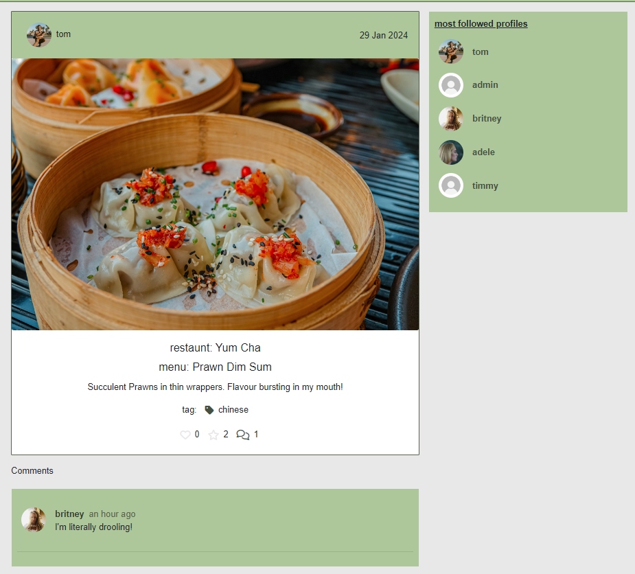

**FE Feature (#16)** : Post Edit

- Only owner of the post can edit their post.
- The post owner can edit a post by clicking the caret drop down menu from the side of the post and select the pencil icon.
- The user will be taken to a post edit form that has all the post information prepopulated.
- The user can then change the image or edit any of the form input as they like.
- The user can then submit their edit by clicking the save edit button.
- The posting guidelines are also listed here.

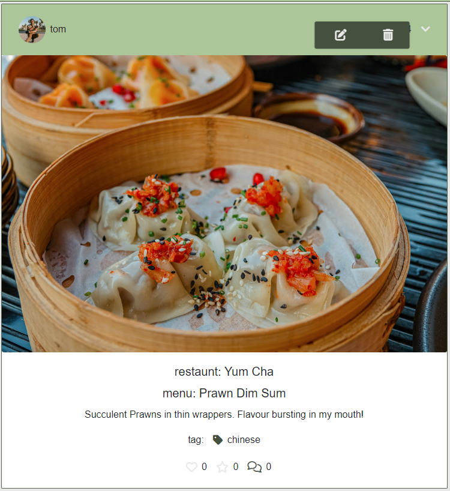
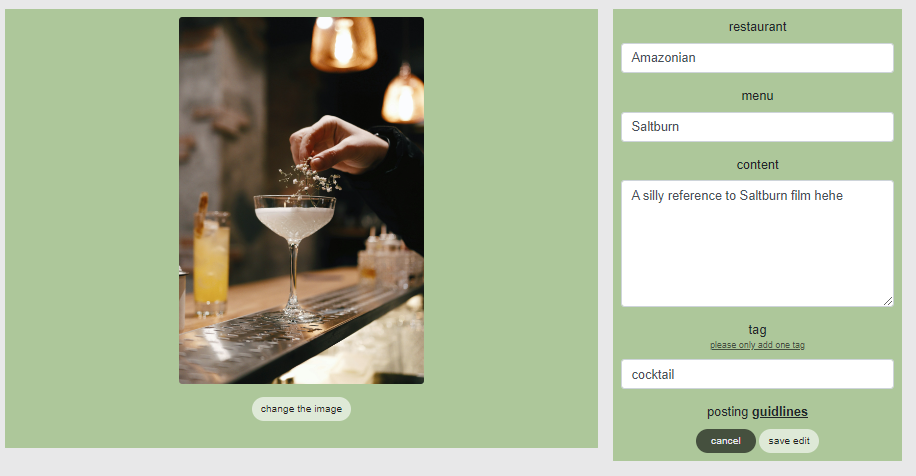

**FE Feature (#17)** : Post Delete

- Only owner of the post can delete their post.
- The post owner can delete a post by clicking the caret drop down menu from the side of the post and select the bin icon.
- The user will be promt with an alert window to confirm their action.

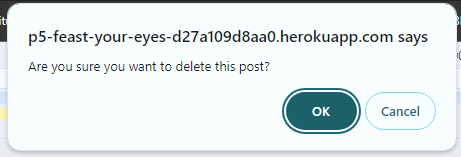

**FE Feature (#18)** : Comment

- Any user can click the comment icon and it will take them to the post detail page
- Only signed in user can use this feature. The form will not be displayed to un-signed in user.
- Signed in user can submit a comment using the form.
- The comment section featured Infinity scroll when there are more than 10 comments.
- The comment time is shown in how long time has passed since the user left that comment or edited that comment.

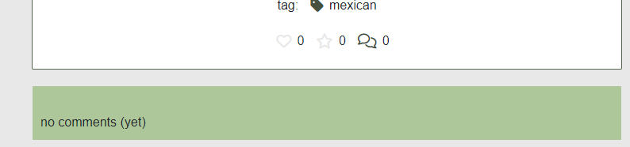

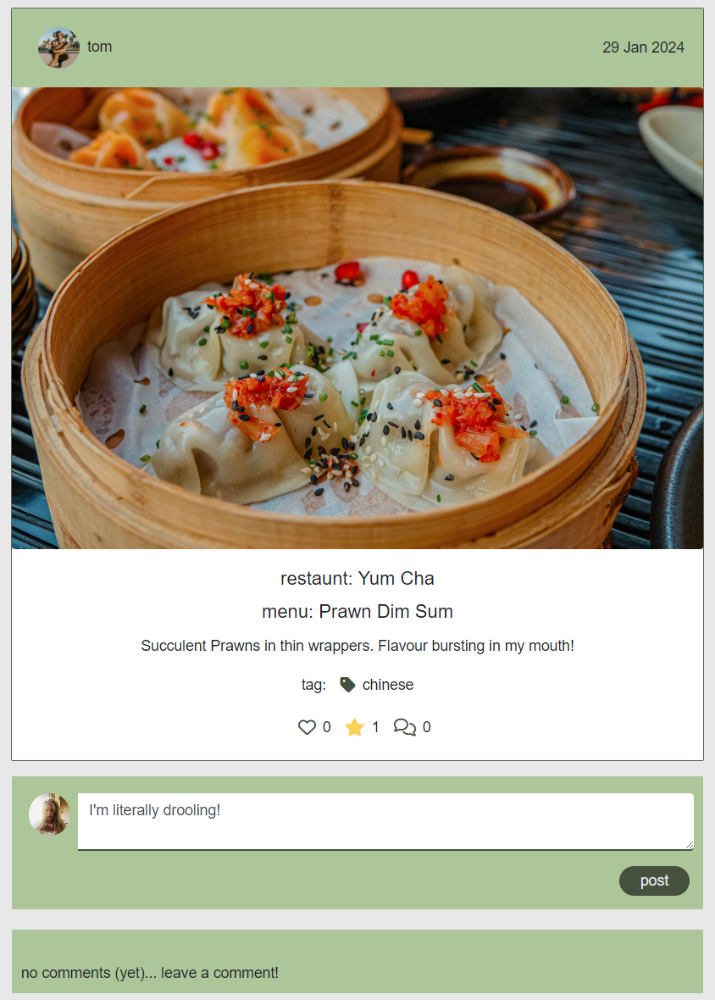

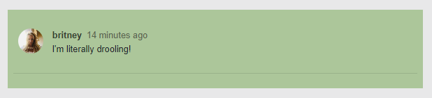

**FE Feature (#19)** : Comment Edit

- Only owner of the comment can edit their comment.
- The comment owner can edit a comment by clicking the claret drop down menu from the side of the comment and select the pencil icon.
- The comment form will appear and the user can now edit their comment.

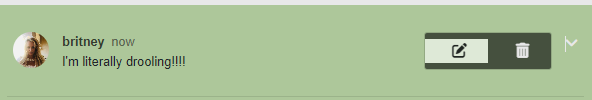

**FE Feature (#20)** : Comment Delete

- Only owner of the comment can delete their comment.
- The comment owner can delete a comment by clicking the caret drop down menu from the side of the comment and select the bin icon.
- The user will be promt with an alert window to confirm their action.

**FE Feature (#21)** : Follow / Unfollow

- Only signed in user can use this feature.
- The user can follow or unfollow a profile if they wish to by clicking the follow/unfollow button.
- If the profile they are trying to follow/unfollow is popular, the can simply follow/unfollow them by clicking on the follow/unfollow button from the popular profile panel.
- If the profile is not listed on the popular profile panel, the user can find the follow/unfollow on the profile page of that user.

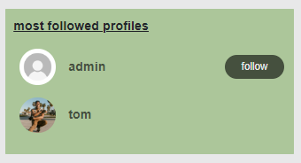

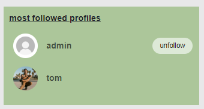

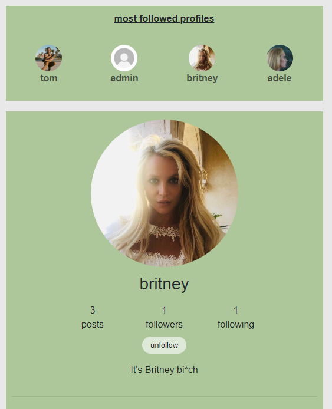

**FE Feature (#22)** : Feed view

- Only signed in user can use this feature.
- The feed view features posts from the profiles that the user has followed.
- The user can use the search bar to further filter the posts

**FE Feature (#23)** : Liked view

- Only signed in user can use this feature.
- The feed view features posts that the user has liked.
- The user can use the search bar to further filter the posts

**FE Feature (#24)** : Recommended View

- Only signed in user can use this feature.
- The feed view features posts that the user has recommended.
- The user can use the search bar to further filter the posts

**FE Feature (#25)** : Profile View

- The user can access another user's profile view by clicking on the profile image/profile name from a post.
- The user can also access it from the popular profile panel.
- Signed in user can access their own profile by using the 2 methods above, or clicking on their profile image/profile name from the NavBar.
- The profile view displays the user's username, image, posts count, followers count, following count, bio, and all the posts they've created.
- The profile view posts section also featured Infinity scroll.
- The owner of the profile can access the dropdown options by clicking the caret that appear where the follow/unfollow button usually is.

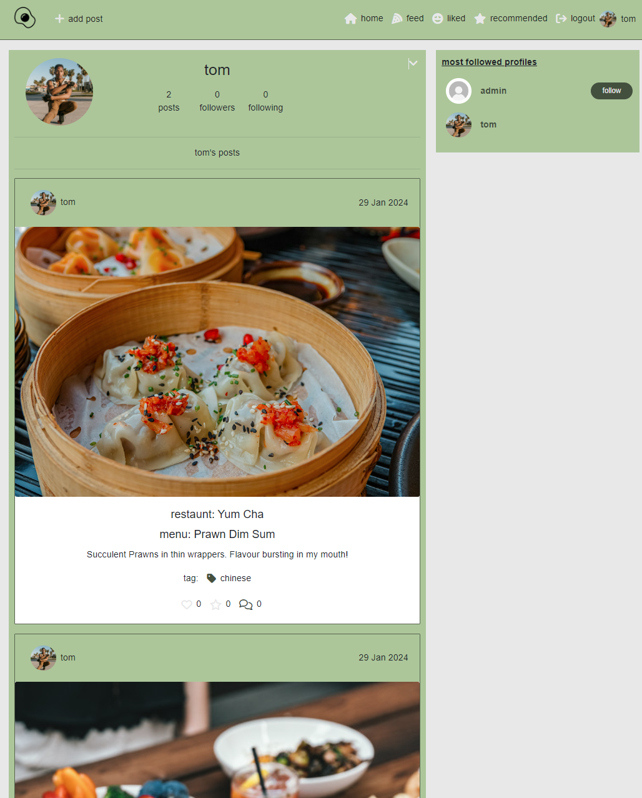

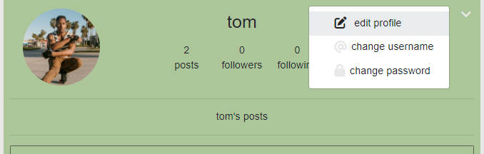

**FE Feature (#26)** : Profile Edit

- The owner of the profile can add a profile image and a short bio about themselves.

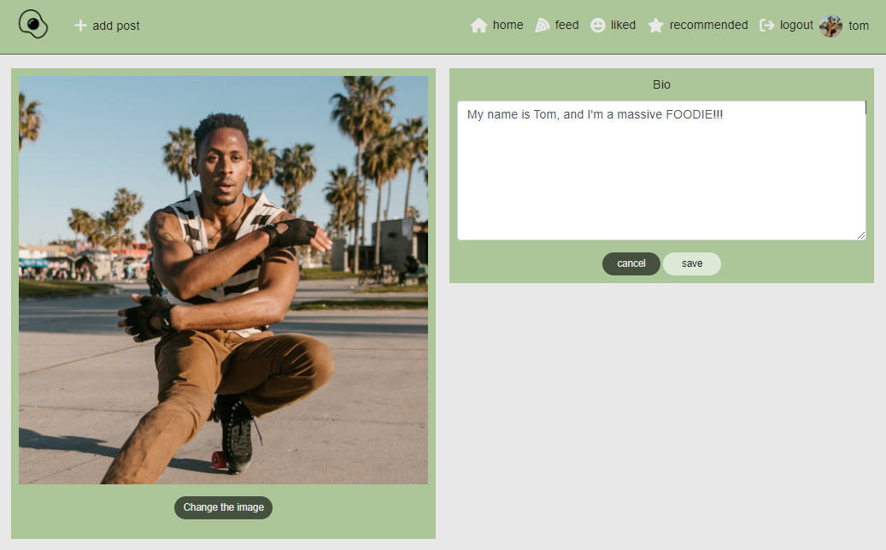

**FE Feature (#27)** : Profile Username Change

- The owner of the profile can also change their username if they wishes.
- Validation are set in place to check if the username is valid. Error message will be displayed.

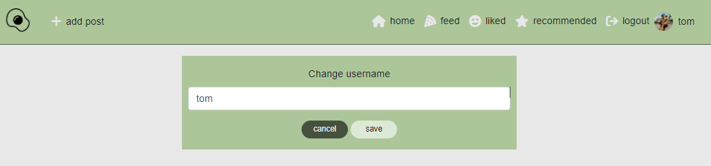

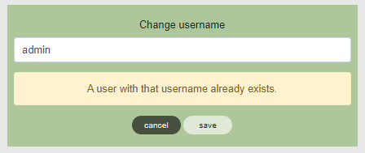

**FE Feature (#28)** : Profile Password Change

- The owner of the profile can also change their password if they wishes.
- Validation are set in place to check if the password is valid. Error message will be displayed.
- An alert window will pop up to confirm the password change.

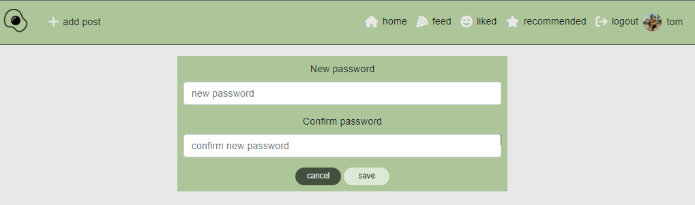

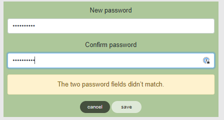

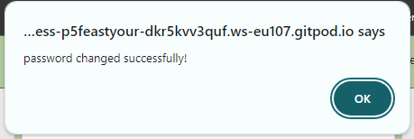

### How these features support the user stories

<!-- reminder -->

- The user stories are numbered from 1 to 38. The features are also numbered from 1 to 28. Below is the cross-reference between the user stories and features, to illustrate that the features satisfies the user stories.
<!-- reminder -->

 <!-- reminder -->

### Feature that could be implemented in the future

- Allow admin/superuser to perform edit/delete post/profile from front end.

  - Currently only owner of the post/profile can edit/delete from the front end.
  - Admin/superuser have to use admin panel.

- Add dropdown for posts in profile view.

  - Currently from the profile view does not allow owner user to edit/delete their post.

- Add emoji reactions.

  - To provide user with a more fun experience, they can use emojis to express their opinion without having to add comment.

- Google map integration.
  - Integrate Google map's API to display where the restaurant is.

## Design

### Wireframe

**Balsamiq** - The wireframe for the website have been designed using Balsamiq. The wireframe only represents the initial design concept and does not reflect the finishing product.

**Coolors** - The colour scheme was selected with the help of Coolors. The main colour is the Olivine green. Eerie black and this particular shade of Platinum has a green tinted version of black and white. Mustard colour was selected to be the colour for the star icon, and is selected due to the colour and the name to keep in theme with the food website.

**Logo** - The website's logo is an egg. The thought process behind this comes from when the website got it's name "Feast Your Eyes". I wanted the logo to be an illustration of some type of food, then I thought an egg kind of looks like an eye and try to find an illustration of an egg that also kind of look like an eye.

Wireframes

- Home
  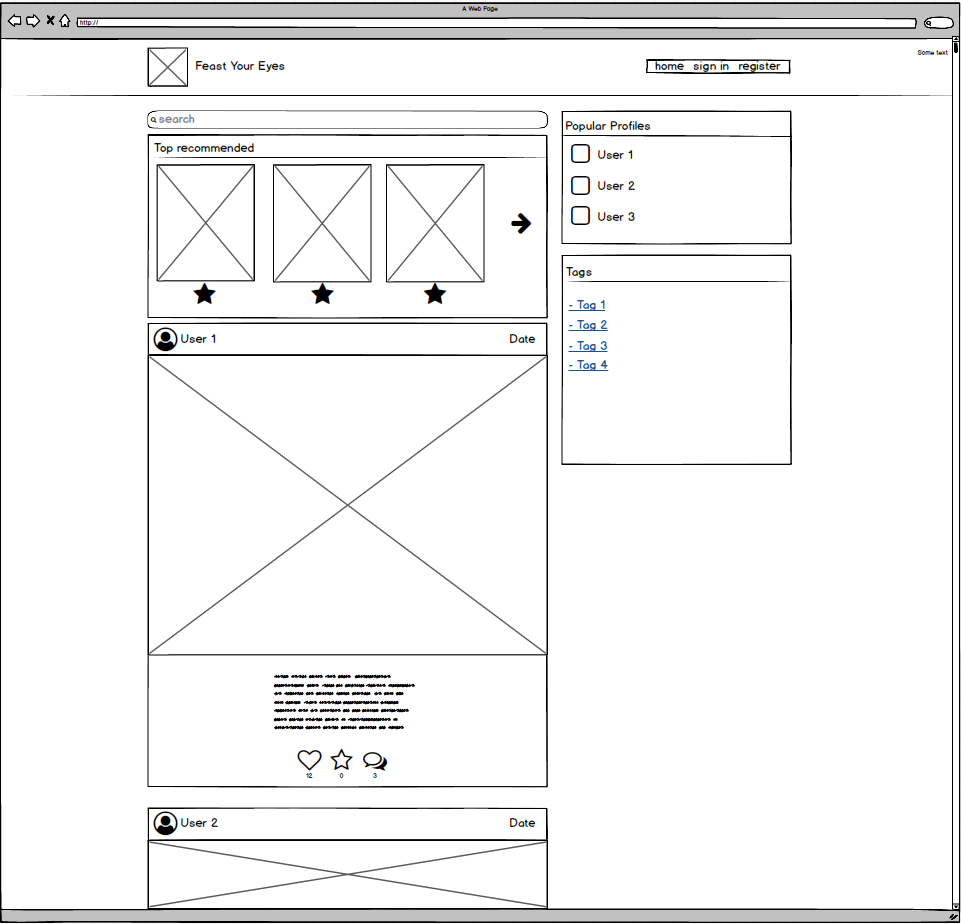

- Register
  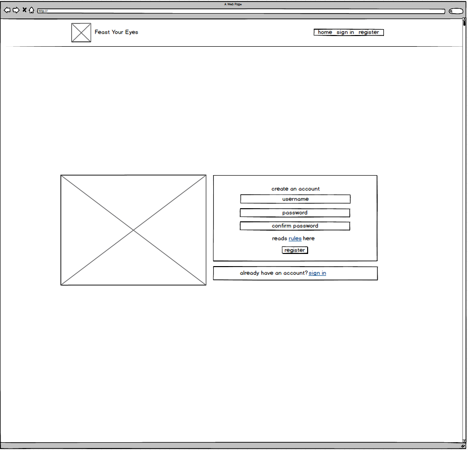

- Sign in
  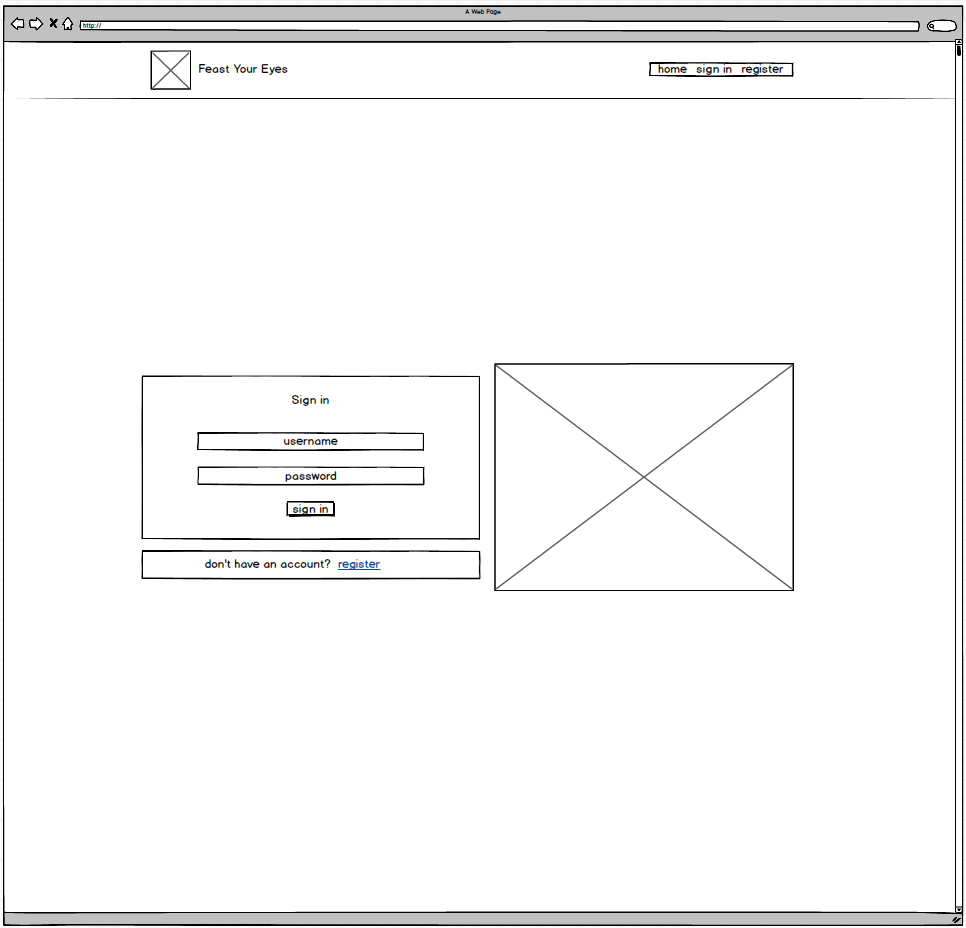

- Add post
  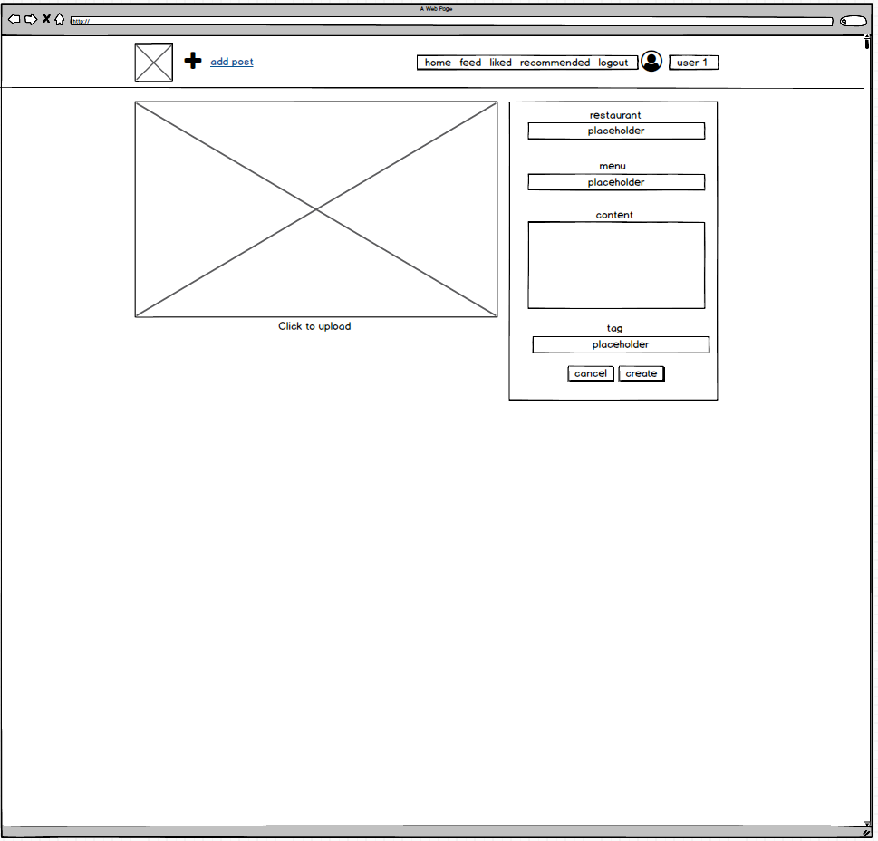

- Post detail
  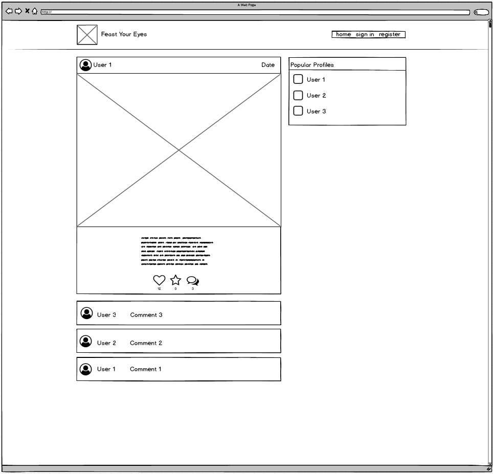

- Profile page
  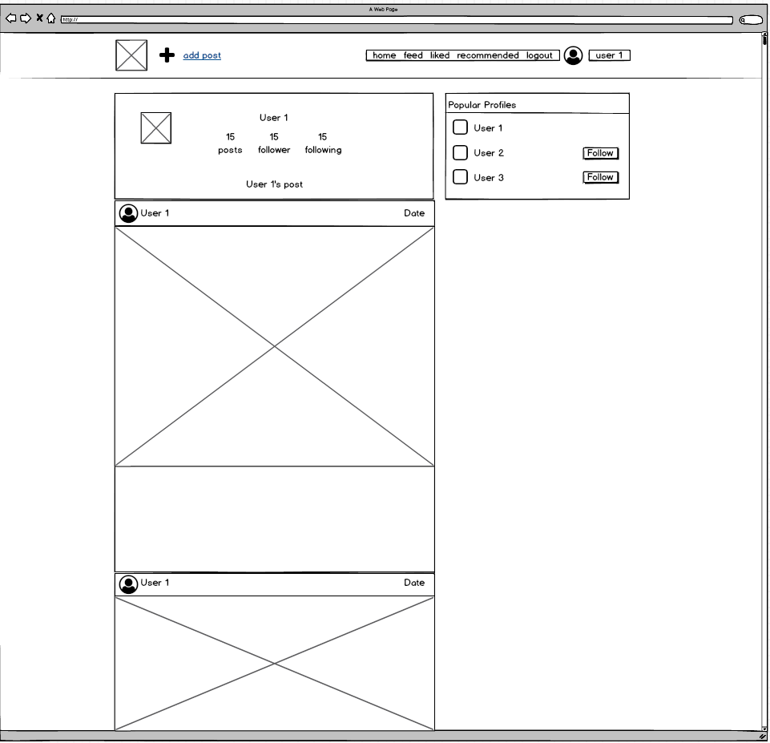

- Modal
  

- Error page
  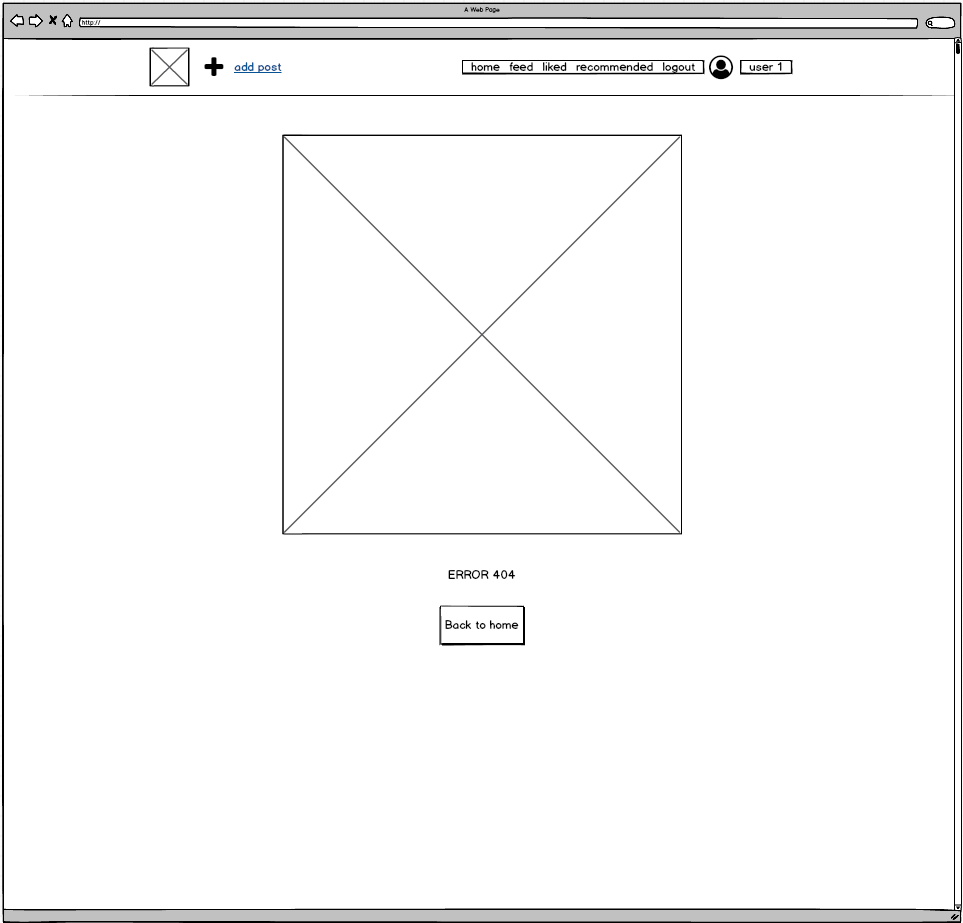

 

### Entity-Relationship for the Database

- The ER model is created on **Lucidchart**

* Profile
  - The Profile model has a 1 to 1 relationship with User model. Because of the signal in the Profile model. A User object is created when Profile is created.
  - The Profile Model has a one to many relationship with Follower, as one profile can follow many profiles.
* User
  - The User model has a one to many relationship with Follower, as one profile can have many followers.
  - The User model has a one to many relationship with Like, as one profile can have many likes.
  - The User model has a one to many relationship with Recommend, as one profile can have many recommendations.
  - The User model has a one to many relationship with Comment, as one profile can have many comments.
  - The User model has a one to many relationship with Post, as one profile can have many posts.
* Post
  - The Post model has a many to one relationship with Likes, as one post can have many likes.
  - The Post model has a many to one relationship with Recommend, as one post can have many recommendations.
  - The Post model has a many to one relationship with Comment, as one post can have many comments.

## Planning

- The Github Project and Issues was utilise to facilitate the Agile Development Methodology. User Stories were created from User Stories template with acceptance criteria. The development process was aided by Kanban board feature of the Project to visualise what needs to be worked on and what is completed. All the User Stories are linked to EPICs to show how to support each other and what must be achieved to complete development goals.

The EPICs, User Stories, and Kanban Board can be viewd here : [Feast Your Eyes Agile Development Tool](https://github.com/users/yamesjamess/projects/8)

## Technologies Used

### Languages Used

- [HTML5](https://en.wikipedia.org/wiki/HTML5)
- [CSS3](https://en.wikipedia.org/wiki/Cascading_Style_Sheets)
- [JSX](<https://en.wikipedia.org/wiki/JSX_(JavaScript)>)
- [Python](https://www.python.org/)

### Frameworks, Libraries & Programs Used

- [Lucidchart](https://www.lucidchart.com/pages/): Used to create a ER Diagram during the design and planning stage. Outline what model is needed and how to related to each other.
- [Google Fonts:](https://fonts.google.com/): Used for Quicksand font.
- [Font Awesome:](https://fontawesome.com/) : Used to add icons for aesthetic and UX purposes.
- [Balsamiq:](https://balsamiq.com/): Used to create the wireframes during the design process.
- [Django](https://www.djangoproject.com/): Used as the framework to support rapid and secure development of the application.
- [Django REST Framework](https://www.django-rest-framework.org/): Used as the framework to create the backend API
- [React Bootstrap](https://react-bootstrap.netlify.app/): Used to build quick responsive web pages.
- [Gunicorn](https://gunicorn.org/): Used as the Web Server to run Django on Heroku.
- [dj_database_url](https://pypi.org/project/dj-database-url/): Library used to allow database urls to connect to the postgres db.
- [psycopg2](https://pypi.org/project/psycopg2/): Database adapter used to support the connection to the postgres db.
- [ElephantSQL](https://www.elephantsql.com/): Used to host the database.
- [Cloudinary](https://cloudinary.com/): Used to store the images used by the application.
- [Django allauth](https://django-allauth.readthedocs.io/en/latest/index.html): Used for account registration and authentication.
- [Django testing tools](https://docs.djangoproject.com/en/3.2/topics/testing/tools/): Used for Django python MVT testing.
- [coverage](https://coverage.readthedocs.io/en/coverage-5.5/): Used to check how much of the python code has been covered by automated tests.
- [Pillow](https://pillow.readthedocs.io/en/stable/): Used for processing images.
- [Git](https://git-scm.com/): Used for version controlling purposes through git commands via the terminal on GitPod and is pushed to GitHub for cloud-based storage.
- [GitHub](https://github.com/): Used to host the repository of the project.
- [Heroku](https://heroku.com): Used to host and deploy the website.
- [favicon.io](https://favicon.io/): Used to create favicon.
- [Tint & Shade Generator](https://maketintsandshades.com/): Used to create different shade of the theme colours.
- [coolors](https://coolors.co/): Used to generate theme colours for the website.

## Testing

### Validator Testing

[HTML Validator](https://validator.w3.org/)

HTML Validation results

- **results for "/"**

  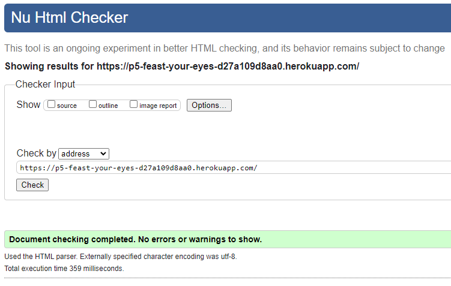

- **results for "/feed"**

  

- **results for "/register"**

  

- **results for "/signin"**

  

- **results for "/post/create"**

  

- **results for "/post/:id"**

  

- **results for "/post/:id/edit"**

  

- **results for "/profile/:id"**

  

- **results for "/profile/:id/edit"**

  

- **results for "/profile/:id/edit/username"**

  

- **results for "/profile/:id/edit/password"**

  

- **results for "/liked"**

  

- **results for "/recommended"**

  

 

[CSS Validator](https://jigsaw.w3.org/css-validator/)

CSS Validation results

- **results for "App.module.css"**

  

- **results for "Asset.module.css"**

  

- **results for "Avatar.module.css"**

  

- **results for "Button.module.css"**

  

- **results for "CommentCreateEditForm.module.css"**

  

- **results for "Comment.module.css"**

  

- **results for "DropDownOptions.module.css"**

  

- **results for "Error.module.css"**

  

- **results for "Modal.module.css"**

  

- **results for "NavBar.module.css"**

  

- **results for "PostCreateEditForm.module.css"**

  

- **results for "PostListPage.module.css"**

  

- **results for "Post.module.css"**

  

- **results for "ProfilePage.module.css"**

  

- **results for "Profile.module.css"**

  

- **results for "RegisterSignInForm.module.css"**

  

- **results for "Tags.module.css"**

  

- **results for "TopRecommend.module.css"**

  

 

[CI Python Linter](https://pep8ci.herokuapp.com/)

Python Validation results

- **results for "comments/model.py"**

  

- **results for "comments/serializers.py"**

  

- **results for "comments/test_model.py"**

  

- **results for "comments/test_view.py"**

  

- **results for "comments/views.py"**

  

- **results for "followers/model.py"**

  

- **results for "followers/serializers.py"**

  

- **results for "followers/test_model.py"**

  

- **results for "followers/test_view.py"**

  

- **results for "followers/views.py"**

  

- **results for "likes/model.py"**

  

- **results for "likes/serializers.py"**

  

- **results for "likes/test_model.py"**

  

- **results for "likes/views.py"**

  

- **results for "posts/model.py"**

  

- **results for "posts/serializers.py"**

  

- **results for "posts/test_model.py"**

  

- **results for "posts/test_view.py"**

  

- **results for "posts/views.py"**

  

- **results for "profiles/model.py"**

  

- **results for "profiles/serializers.py"**

  

- **results for "profiles/test_model.py"**

  

- **results for "profiles/test_view.py"**

  

- **results for "profiles/views.py"**

  

- **results for "recommends/model.py"**

  

- **results for "recommends/serializers.py"**

  

- **results for "recommends/test_model.py"**

  

- **results for "recommends/views.py"**

  

 

[Google Lighthouse](https://developer.chrome.com/docs/lighthouse/overview)

Lighthouse Validation results

- The reason for a lower score in performance for both desktop and mobile is due to the fact that post images are uploaded by the users. Without any post submission processing to compress and convert the image into a more suitable size and extension, it causes the performance score to drop.

- **results for "desktop"**

  

- **results for "mobile"**

  

 

[ESLint](https://eslint.org/)

ESLint Validation results

- **results for "eslint"**

  

- When ESLint is run and returns no results, it means that there are no errors detected.

 

### Automated Testing

DRF API tests results

- The DRF API was tested with [Django testing tools](https://docs.djangoproject.com/en/4.2/topics/testing/tools/).
- The coverage tool has been used to check coverage of the test.

- **results for "drf api tests results"**

  

- **results for "drf api coverage results"**

  

 

DB tests were run in the development environment against a local SQLite3 database.

### Browser Compatibility

- The website has been tested on the following browsers:
  - Google Chrome Version 121.0.6167.85 (Official Build) (64-bit)
  - Mozilla Firefox Version 121.0 (64-bit)
  - Microsoft Edge Version 121.0.2277.83 (Official build) (64-bit)
  - Apple Safari on macOS Ventura Version 16.5 (18615.2.9.11.4)
  - Apple Safari on iOS 16.6.1 (20G81)

### Test Cases and Results

- The table below details the testing case that was used and the result of the test.

<!-- reminder -->

### Known Bugs

- Recommendation count in the Top 5 recommended post does not automatically refresh.

  - Attempt to add the recommendation count to the dependency array of the useEffect, but nothing happens.

- The user cannot log in to the website on Safari.
  - This is a known issue noted by CI

- Tags list only displays the tags of the first 10 posts.
  - This is due to pagination.

### Unfixed Bugs

- Recommendation count in the Top 5 recommended post does not automatically refresh.
  -  Attempted to fix but is  left Unfix due to time restraint.

- Tags list only displays the tags of the first 10 posts.
  -  Attempted to fix but is  left Unfix due to time restraint.

### How to clone this repository

For DRF API

- Visit the main repository at https://github.com/yamesjamess/p5-feast-your-eyes-drf-api

- Click the "Code" button to the right of the screen, click HTTPs and copy the link present there.

- Open a GitBash terminal and navigate to the directory where you want to clone.

- In the terminal, type "git clone" then paste in the copied URL and press the Enter key to begin the cloning process.

- To install the packages required by the application use the command : pip install -r requirements.txt

- Detailed and step by step instruction can be found on documentation provided by Code Institute on this document: [CI DRF Cheatsheet - Setting up basic Django Project with Cloudinary](https://docs.google.com/document/d/1LCLxWhmW_4VTE4GXsnHgmPUwSPKNT4KyMxSH8agbVqU/edit#heading=h.mpopj7v69qqn)

For Front End

- Visit the main repository at https://github.com/yamesjamess/p5-feast-your-eyes

- Click the "Code" button to the right of the screen, click HTTPs and copy the link present there.

- Open a GitBash terminal and navigate to the directory where you want to clone.

- In the terminal, type "git clone" then paste in the copied URL and press the Enter key to begin the cloning process.

- To install the packages required by the application use the command : nvm install 16

## Deployment

- DRF API

  - Detailed and step by step instruction can be found on documentation provided by Code Institute on this document: [CI DRF Cheat Sheet - Deployment](https://docs.google.com/document/d/1v8mOyB5l7aSL5loy3MVIX4z4SsLYKe-ZEGGpT_Z5DRM/edit#heading=h.7xtx0jslcwbv)

- Front End
  - How to deploy the program on Heroku
    - Log in to Heroku at https://heroku.com - create an account if needed.
    - From the Heroku dashboard, click the Create new app button. For a new account an icon will be visible on screen to allow you to Create an app, otherwise a link to this function is located under the New dropdown menu at the top right of the screen.
    - On the Create New App page, enter a unique name for the application and select region. Then click Create app.
    - Create a Procfile in your project and add "web: serve -s build" into the file.
    - Add, Commit, and push any local changes to GitHub.
    - Go to the Deploy tab on Heroku.
    - Connect to your GitHub.
    - Search the repo, for this project the repo is called "p5-feast-your-eyes".
    - Choose the main branch to deploy.
    - Click the deploy button.
    - Check the logs for any errors.

#### The live link to the application can be found here - [Feast Your Eyes](https://p5-feast-your-eyes-d27a109d8aa0.herokuapp.com/)

## Credits

### Code

- Majority of the code comes from the Code Institute's Advanced Front End Course - Moments walkthrough
- The rest of the code has been adapted and created by the developer.
- Django test: [TransactionManagementError](https://stackoverflow.com/questions/43978468/django-test-transactionmanagementerror-you-cant-execute-queries-until-the-end)

- ESLint configuration
  - https://stackoverflow.com/questions/72780296/warning-react-version-not-specified-in-eslint-plugin-react-settings-while-run
  - https://stackoverflow.com/questions/49789177/module-is-not-defined-and-process-is-not-defined-in-eslint-in-visual-studio-code
  - https://stackoverflow.com/questions/42541559/eslint-with-react-gives-no-unused-vars-errors
  - https://stackoverflow.com/questions/56398742/eslint-throws-no-undef-errors-when-linting-jest-test-files
  - https://stackoverflow.com/questions/62031536/referenceerror-test-is-not-defined-with-jest
  - https://stackoverflow.com/questions/52992932/component-definition-is-missing-display-name-react-display-name
  - https://github.com/AtomLinter/linter-eslint/issues/462

### Content

- Information on the website is created by the developer.

  - Inpsiration from [Samsung Food](https://samsungfood.com/)
  - The story, all names, characters, and incidents portrayed in this project are fictitious.
  - This is for educational purpose only.

### Media

- Quicksand font was used and imported from [Google Fonts](https://fonts.google.com/)
- The logo is from [Mario Bieh - Noun](https://thenounproject.com/icon/fried-egg-171208/)
- Favicon is created from the logo and converted to favicon by [favicon.io](https://favicon.io/)
- Error 404 image is from [Free Vector](https://www.freepik.com/free-vector/flat-404-error-template_1588538.htm#query=404%20page%20found&position=0&from_view=search&track=ais&uuid=1bccb536-4a56-4d7c-b045-fe54fb3cf756)
- "Adele" profile image by [Andrea Piacquadio - Pexel](https://www.pexels.com/photo/closeup-photo-of-woman-with-brown-coat-and-gray-top-733872/)
- "Britney" profile image by [Daniel Xavier - Pexel](https://www.pexels.com/photo/woman-wearing-black-eyeglasses-1239291/)
- "Henry" profile image by [Stefan Stefancik - Pexel](https://www.pexels.com/photo/man-on-gray-shirt-portrait-91227/)
- "Tom" profile image by [RDNE Stock project - Pexel](https://www.pexels.com/photo/a-man-in-brown-pants-sitting-on-the-street-while-wearing-rollerblades-7335160/)
- Register page image by [Alexy Almond - Pexel](https://www.pexels.com/photo/person-taking-photos-of-food-3757990/)
- Log in page image by [Mizuno K - Pexel](https://www.pexels.com/photo/men-preparing-breakfast-13335440/)
- No Result icon by [Meko - Noun](https://thenounproject.com/icon/no-result-5191447/)
- Upload icon by [Naveen - Noun](https://thenounproject.com/icon/upload-1489457/)

- Content images
  - Some of these images may or may not have been used in the website but will listed anyways.
  - ribs - [Faisal - Unsplash](https://unsplash.com/photos/cooked-ribs-BS4Zeq7xDRk)
  - burgers - [Jenn Kosar - Unsplash](https://unsplash.com/photos/fried-fries-and-burger-on-plate-jrWoDRmhwRY)
  - nachos - [Spencer Davis - Unsplash](https://unsplash.com/photos/nachos-on-plate-znc9hSxXBJw)
  - poke bowl - [Jonathan Borba - Unsplash](https://unsplash.com/photos/flat-lay-photography-bowl-of-vegetable-Gkc_xM3VY34)
  - beef stick - [Markus Winkler - Unsplash](https://unsplash.com/photos/beef-on-sticks-display-PcBmNPteF_0)
  - pasta - [Liubov Ilchuk - Unsplash](https://unsplash.com/photos/four-filled-wine-glasses-and-foods-on-table-_qZOwG2oaj4)
  - dim sum - [The Free Birds - Unsplash](https://unsplash.com/photos/white-rice-on-brown-wooden-bowl-6bF6kS4WJk0)
  - french toast - [Crystal Jo - Unsplash](https://unsplash.com/photos/brown-bread-on-white-ceramic-plate-Q58N5cBKDZ8)
  - Irish breakfast - [Melissa Walker Horn - Unsplash](https://unsplash.com/photos/food-photography-of-grilled-foods-with-beans-WbA_PCv3_Co)
  - Japanese food - [Paulo Doi - Unsplash](https://unsplash.com/photos/pasta-dish-in-stainless-steel-bowl-6uTQmtqcAzs)
  - sushi - [Fadya Azhary - Unsplash](https://unsplash.com/photos/sushi-on-wooden-platter-5KS7T3Gs3CA)
  - cheese - [Azzedine Rouichi - Unsplash](https://unsplash.com/photos/a-bunch-of-cheese-stacked-on-top-of-each-other-YW_5rJvAdKw)
  - meal prep - [S'well - Unsplash](https://unsplash.com/photos/four-clear-plastic-bowls-with-vegetables-CJdZ800-Fbs)
  - cocktail - [Emily Andreeva - Unsplash](https://unsplash.com/photos/person-holding-clear-wine-glass-with-white-liquid-hXg4gGjIfhw)
  - steak - [Hanxiao - Unsplash](https://unsplash.com/photos/cooked-food-on-black-ceramic-plate-beside-wine-glass-on-table-aBnl2R-wpaM)
  - grilled fish - [Faisal - Unsplash](https://unsplash.com/photos/grilled-meat-with-sliced-cucumber-and-sliced-cucumber-on-white-ceramic-plate-cYCUqX97w4c)
  - fried seafood - [Antonio Mendes - Unsplash](https://unsplash.com/photos/assorted-fried-foods-i5hzQrNBbR0)
  - pizza - [Unleashed Agency - Unsplash](https://unsplash.com/photos/pizza-on-brown-wooden-box-EZpGDYWBAYA)
  - pie - [Elena Sambros - Unsplash](https://unsplash.com/photos/red-and-white-bread-on-white-ceramic-plate-iWwqLcX353E)
  - hotpot - [Xiong Gordon - Unsplash](https://unsplash.com/photos/vegetable-dish-on-brown-ceramic-bowl-kpC36hIsODQ)
  - bakery - [Siebe Warmoeskerken - Unsplash](https://unsplash.com/photos/pantry-display-counter-R3iAcQxylmE)
  - wrap - [Andrew Valdivia - Unsplash](https://unsplash.com/photos/a-person-holding-a-sandwich-in-a-brown-box-nKKzs2oqsMk)
  - sandwich - [Sincerely Media - Unsplash](https://unsplash.com/photos/taco-on-brown-tray-WlHG7QIjabo)
  - taco - [Spencer Davis - Unsplash](https://unsplash.com/photos/three-fresh-tacos-on-gray-tray-hs2076lrvKQ)
  - enchilada - [Daniel Lloyd Blunk-Fernndez - Unsplash](https://unsplash.com/photos/green-vegetable-on-white-ceramic-plate-14FSe2g8mhE)
  - chick fil a - [Brad - Unsplash](https://unsplash.com/photos/a-chicken-sandwich-sitting-on-top-of-a-piece-of-paper-PcXZtTcRNvY)
  - Italian soup - [Cloris Ying - Unsplash](https://unsplash.com/photos/round-white-ceramic-bowl-with-seafoods-rmdo8r9iGfw)
  - afternoon tea - [Sebastian Coman Photography - Unsplash](https://unsplash.com/photos/clear-long-stem-wine-glass-Ekqld5tI3JA)
  - fish and chips - [Meelan Bawjee - Unsplash](https://unsplash.com/photos/cooked-meat-and-french-fries-in-white-disposable-plate-A_tPBct4tz8)

### Achknowledgements

- Thank you to my mentor, Mo Shami, for the help with this project.
- Special thanks to all the tutors at Code Institute for all your help!
